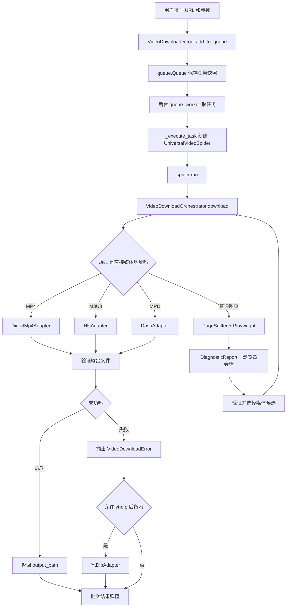

# FireflyTools 视频爬虫新手学习指南

> 适合读者：已经会 Python 基础语法、类、函数和异常处理，但刚开始接触网络爬虫。
>
> 学习重点：沿着一次真实下载任务的执行链路阅读代码，同时理解项目涉及的 HTTP、浏览器会话、MP4、HLS、DASH、AES、FFmpeg 等概念。

## 1. 先确定学习目标

读完这份指南后，你应该能够回答：

1. 用户点击“添加队列”后，任务如何进入后台线程？
2. 程序如何区分 MP4、M3U8、MPD 和普通网页？
3. 普通网页中没有直接视频地址时，Playwright 如何发现媒体请求？
4. 为什么嗅探到了 M3U8，还要再次探测和筛选？
5. HLS 为什么需要下载许多切片，AES、BYTERANGE 和 fMP4 分别是什么？
6. DASH 为什么经常需要分别下载视频轨和音频轨？
7. FFmpeg 在这里负责下载、转码，还是封装合并？
8. 错误如何从底层网络请求传回 UI，并决定是否允许重试？

这不是一份完整的 HLS/DASH 标准手册。它只讲理解当前项目所必需的协议知识，并把每个概念绑定到真实代码。

## 2. 合法使用边界

请只分析和下载你有权访问、保存的公开或自有媒体。项目明确不做以下事情：

- 不绕过 Widevine、FairPlay、PlayReady 等 DRM。
- 不破解验证码、登录、付费墙、地区限制或账号权限。
- 不伪装成恶意高并发客户端攻击网站。
- 不保证所有站点都能下载；403、令牌过期或媒体服务器拒绝直连都是正常边界。

可视化嗅探允许用户在浏览器里完成站点允许的人工操作，但程序不会自动突破访问控制。

## 3. 学习前准备

在项目根目录执行：

```powershell
python -m venv .venv
.\.venv\Scripts\Activate.ps1
python -m pip install -r requirements.txt
playwright install chromium
python -m tools.main
```

Windows 版 FFmpeg 位于 `tools/ffmpeg.exe`，由 `tools/runtime_setup.py` 加入子进程的 `PATH`。必须从项目根目录启动，因为 `./downloads`、`./temp` 和 `./browser_profiles` 都依赖当前工作目录。

首次阅读时建议同时打开三个窗口：

- 编辑器：查看本指南列出的源码。
- 程序界面：添加一个你有权访问的测试 URL。
- 终端：运行对应的单元测试。

不要一上来逐行阅读 `tools/video_crawler/adapters/hls.py`。它包含协议、并发、恢复和合并等多种问题，适合在建立整体地图后再读。

## 4. 三遍阅读法

### 第一遍：只追踪“谁调用谁”

目标是看懂最短主线，不研究每个循环：

```text
VideoDownloaderTool
  -> UniversalVideoSpider
  -> VideoDownloadOrchestrator
  -> DirectMp4Adapter / HlsAdapter / DashAdapter
  -> 输出文件或 VideoDownloadError
  -> UI 批次结果弹窗
```

### 第二遍：理解“数据怎样变化”

重点追踪这些对象：

- 普通任务字典 `task`
- `MediaCandidate`
- `DiagnosticReport`
- `BrowserSessionSnapshot`
- `VideoDownloadError`
- `SegmentManifest`

### 第三遍：进入协议和边界情况

最后再研究：

- Playwright 的响应监听与等待策略。
- 多个 M3U8 的正片、画质选择。
- HLS AES、BYTERANGE、fMP4、多轨和直播。
- DASH MPD 解析、音视频分轨与断点恢复。
- FFmpeg 命令和错误收口。

## 5. 一次下载任务的全链路



最关键的设计思想是：**先把 URL 解析成统一的媒体候选，再由适配器处理不同协议。** UI 不需要知道 AES 怎么解密，HLS 下载器也不需要知道按钮是什么颜色。

## 6. 第一站：先读模型和错误

### 阅读顺序

1. `tools/video_crawler/models.py`
2. `tools/video_crawler/errors.py`
3. `tools/video_crawler/adapters/base.py`

### 6.1 `MediaKind` 和 `MediaCandidate`

`MediaKind` 把媒体分为：

| 类型 | 含义 |
| --- | --- |
| `DIRECT_MP4` | 可直接请求的 MP4 文件 |
| `HLS` | 以 M3U8 描述的 HLS 流 |
| `DASH` | 以 MPD 描述的 DASH 流 |
| `DRM` | 疑似受 DRM 保护的媒体 |
| `UNKNOWN` | 暂时不能识别 |

`MediaCandidate` 是各层之间的共同语言。最重要的字段是：

- `url`：候选媒体地址。
- `kind`：媒体类型。
- `source`：来自直接 URL、网络响应还是响应正文。
- `score`：候选可信度，不等于视频画质。
- `segment_count`、`bandwidth`：探测后可能补充的流信息。
- `requires_session`：是否可能依赖浏览器会话。

先理解这个数据类，后面就不会把“嗅探”“筛选”“下载”误认为一件事。

### 6.2 `DiagnosticReport`

`DiagnosticReport` 把一次网页分析结果装在一起：

- `candidates`：找到的候选媒体流。
- `session`：浏览器会话快照。
- `warnings`：例如发现 DASH 或 DRM。
- `errors`：诊断阶段的错误说明。

`best_candidate` 只按 `score` 取候选；真正的多 M3U8 正片和画质选择发生在 `UniversalVideoSpider._select_best_m3u8()`，不要混淆。

### 6.3 `VideoDownloadError`

普通异常只有文本，UI 很难决定怎么提示。`VideoDownloadError` 额外保存：

- `code`：稳定的结构化错误码。
- `details`：供调试使用的细节。
- `retryable`：是否适合直接重试。

例如 `NETWORK_TIMEOUT` 可以稍后重试，而 `UNSUPPORTED_DRM` 不应通过重复请求解决。

### 6.4 适配器协议

`VideoAdapter` 是 Python 的 `Protocol`，它约定适配器都要提供：

```python
can_handle(candidate)
download(candidate, output_filename)
diagnose(url)
```

`VideoDownloadOrchestrator` 按 `priority` 从高到低选择第一个能处理候选的适配器：

```text
DirectMp4Adapter: 100
HlsAdapter:       80
DashAdapter:      60
```

这是一种策略模式：编排器只负责选择，具体协议逻辑留在各适配器中。

### 第一遍可以跳过

- 数据类中不常用的 `notes`。
- `DiagnosticReport.to_user_summary()` 的字符串格式。
- 每个错误码的全部触发位置。

### 动手验证

```powershell
python -m unittest tests.test_video_crawler_models tests.test_video_crawler_adapters -v
```

观察测试怎样构造假的 `MediaCandidate`，以及编排器怎样选中优先级最高的适配器。

## 7. 第二站：走通最短的 MP4 直链

先读 `tools/video_crawler/adapters/direct_mp4.py`，因为它是最简单的下载路径。

### 调用顺序

```text
DirectMp4Adapter.download
  -> 拼出 output_dir/文件名.mp4
  -> DirectMp4Adapter.download_url
  -> requests.get(stream=True)
  -> iter_content 每次读取 1 MiB
  -> 写入文件
  -> 返回保存路径
```

### 这里涉及的 HTTP 概念

#### URL

一个典型地址可以拆成：

```text
https://cdn.example.com/video/movie.mp4?token=abc
|协议|       主机       |      路径       | 查询参数 |
```

项目通过路径中的 `.mp4`、`.m3u8`、`.mpd` 快速识别直链，但普通网页需要进一步嗅探。

#### GET 请求和状态码

`requests.get()` 发出 HTTP GET 请求。`response.raise_for_status()` 会把 4xx、5xx 响应转成异常。常见状态：

- `200 OK`：服务器返回内容。
- `206 Partial Content`：服务器响应 Range 分段请求。
- `403 Forbidden`：服务器理解请求，但拒绝访问。
- `404 Not Found`：资源不存在。
- `429 Too Many Requests`：请求过快。
- `503 Service Unavailable`：服务暂时不可用。

HTTPS 可以理解为“HTTP 通过 TLS 加密传输”。代码仍按 HTTP 请求与响应处理业务数据，证书校验和传输加密由 `requests`、`aiohttp`、浏览器及其底层库完成。

#### 流式读取

`stream=True` 不会一次把整个视频载入内存。`iter_content()` 每次读取一块并写入磁盘，这对大文件很重要。

#### Content-Length

响应头 `Content-Length` 表示总字节数，项目用它计算进度。如果服务器没有提供，下载仍可继续，只是不显示百分比。

### 第一遍可以跳过

- 10% 一次的进度日志细节。
- `download_url` 测试注入钩子。

### 动手练习

在纸上或注释中回答：如果 `Content-Length` 为 0，为什么程序仍能写完文件？答案应落在“读取以响应流结束为准，长度只用于进度”上。

## 8. 第三站：UI 队列与后台线程

阅读 `tools/video_downloader.py`，建议只按下面的函数顺序跳读：

```text
VideoDownloaderTool.add_to_queue
VideoDownloaderTool._enqueue_task
VideoDownloaderTool.queue_worker
VideoDownloaderTool._execute_task
VideoDownloaderTool._finish_task
VideoDownloaderTool.format_batch_results
VideoDownloaderTool.show_batch_results
```

### 8.1 为什么任务要做快照

加入队列时，程序把 URL、文件名、保存目录、并发数、断点续传、直播秒数和嗅探选项保存到普通字典 `task`。

这叫任务快照。假设用户添加任务 A 后修改并发数，再添加任务 B，A 应继续使用原来的并发数，而不是执行时读取最新 UI 值。

### 8.2 `queue.Queue`

`queue.Queue` 是线程安全队列：

- UI 线程调用 `put()` 添加任务。
- 后台 `queue_worker()` 调用 `get()` 顺序取任务。
- 完成后调用 `task_done()` 更新未完成计数。

### 8.3 PyQt 信号为什么重要

后台线程不应随意直接修改 Qt 控件。项目用信号传递：

- `log_signal`：把日志发回 UI。
- `queue_pop_signal`：移除队列显示项。
- `batch_finished_signal`：一批任务结束后弹出汇总。

可以把信号理解为“线程间投递消息”，而不是普通函数调用。

### 8.4 `_execute_task()` 是 UI 与爬虫核心的边界

它负责：

1. 用任务快照构造 `SnifferOptions`。
2. 创建 `UniversalVideoSpider`。
3. 调用 `spider.run(url, name)`。
4. 把成功路径或结构化错误转成结果字典。
5. 满足条件时调用 yt-dlp 后备。

### 第一遍可以跳过

- 控件创建、QSS 和滚动区域布局。
- 批次弹窗的每一行文案。
- 重试按钮的 UI 细节。

### 动手验证

```powershell
$env:QT_QPA_PLATFORM='offscreen'
python -m unittest tests.test_video_downloader.VideoDownloaderToolTests -v
```

重点看包含 `snapshots`、`worker_passes` 和 `batch` 的测试名称。

## 9. 第四站：核心编排器 `UniversalVideoSpider`

阅读 `tools/video_crawler/spider.py`，推荐顺序：

```text
UniversalVideoSpider.__init__
UniversalVideoSpider._build_orchestrator
UniversalVideoSpider.run
UniversalVideoSpider._resolve_candidate
UniversalVideoSpider._classify_direct_url
UniversalVideoSpider._sniff_real_url
UniversalVideoSpider._select_best_m3u8
UniversalVideoSpider._verify_output
```

### 9.1 `run()` 为什么很短

`run()` 只记录模式、调用 `orchestrator.download()` 并验证输出。复杂逻辑被拆到候选解析器和适配器中，这使主流程保持稳定。

### 9.2 直接媒体与普通网页

`_resolve_candidate()` 先调用 `_classify_direct_url()`：

- `.mp4` -> `DIRECT_MP4`
- `.m3u8` -> `HLS`
- `.mpd` -> `DASH`
- 其他 -> 交给 `PageSniffer`

嗅探成功后，程序还会把浏览器会话中的安全请求头合并进下载请求，再重新分类真实媒体 URL。

### 9.3 多个 M3U8 为什么要分两步选

网页中可能同时出现：

- 正片流。
- 广告或预告片。
- 同一正片的不同 CDN 地址。
- 同一视频的不同清晰度。

当前选择分两层：

1. **正片近似判断**：先统计切片数量，保留接近最大切片数的候选。容差是 `max(3, 最大切片数的 5%)`。
2. **画质判断**：在这些候选中按带宽、分辨率像素数、切片数排序。

因此“切片数相同”并不表示画质相同，切片数量主要帮助识别时长相近的正片。画质更依赖 `bandwidth` 和 `resolution`。

如果候选是 HLS master playlist，程序会先读取其中最高带宽的 variant，再统计那个 media playlist 的切片数。若 URL 包含 `/3000k/` 等片段，也可能作为带宽线索。

如果所有 M3U8 都无法验证，程序不会盲目下载“最后一个地址”，而是抛出 `NETWORK_TIMEOUT` 或 `M3U8_PARSE_FAILED`。

### 9.4 输出验证

`_verify_output()` 同时检查：

- 路径确实是文件。
- 文件大小大于 0。

日志说“开始合并”不代表任务成功，最终返回必须经过这里。

### 动手验证

```powershell
python -m unittest tests.test_video_downloader.UniversalVideoSpiderTests.test_select_best_m3u8_prefers_higher_bandwidth_when_segments_tie -v
```

这个测试直接回答“切片数量相同时是否只选第一个”的问题。

## 10. 第五站：Playwright 网页嗅探

阅读顺序：

1. `tools/video_crawler/sniffer.py`
2. `tools/video_crawler/session.py`
3. `tools/video_crawler/diagnostics.py`
4. `tools/video_crawler/reporting.py`
5. `tools/video_crawler/logging_utils.py`

### 10.1 为什么普通 `requests` 不一定够用

很多网页的 HTML 中没有最终视频地址。JavaScript 会在用户点击播放后请求播放器接口、M3U8 或 MPD。`PageSniffer` 启动 Chromium，让页面脚本真实运行，并监听网络响应。

### 10.2 响应监听

`PageSniffer.sniff()` 为页面注册 `response` 事件。每个响应经过 `classify_media_response()`：

- URL 或 `Content-Type` 包含 M3U8 特征 -> HLS。
- 包含 MPD 或 `application/dash+xml` -> DASH。
- 包含 MP4 或 `video/mp4` -> 直链 MP4。
- 包含 Widevine、PlayReady、FairPlay 特征 -> DRM 警告。

### 10.3 Content-Type

`Content-Type` 是响应头中的媒体类型。例如：

```text
video/mp4
application/vnd.apple.mpegurl
application/dash+xml
application/json
```

URL 可能没有扩展名，因此响应类型是重要的补充证据。

### 10.4 从响应正文提取候选

接口可能返回 JSON、HTML 或 JavaScript，其中包含媒体 URL。`extract_media_urls_from_text()` 会：

1. 还原 `\/`、`\u002F` 等 JSON 转义。
2. 把相对 URL 转成绝对 URL。
3. 只保留合法的 HTTP/HTTPS MP4、M3U8、MPD。
4. 过滤 `https://host/\.m3u8` 这类并非真实地址的正则模板字符串。

正文候选的 `source` 是 `response-body`，可信度低于真实网络媒体请求。因此只在正文发现字符串时，嗅探器不会立即停止等待；它仍希望看到播放器真正发出的请求。

### 10.5 浏览器会话

`BrowserSessionSnapshot` 保存：

- `User-Agent`：客户端身份字符串。
- `Referer`：请求从哪个页面发起。
- `Origin`：请求来源站点。
- Cookie：服务器下发的会话状态。
- 允许继承的请求头，例如 Authorization。
- LocalStorage：页面本地存储的快照。

`build_download_headers()` 只把明确允许的请求头和与目标域名匹配的 Cookie 加入下载请求。LocalStorage 会被记录，但当前代码不会自动把所有 LocalStorage 项目变成请求头。

#### Referer 与 Origin 的区别

- `Referer` 通常是完整来源页面 URL。
- `Origin` 通常只有协议、域名和端口。

一些媒体服务器会检查它们，缺失时可能返回 403。

#### Cookie 与 LocalStorage 的区别

- Cookie 会随匹配域名的 HTTP 请求发送。
- LocalStorage 默认只由页面 JavaScript 读取，不会自动随请求发送。

#### CORS 与服务器防盗链

CORS 是浏览器对跨来源 JavaScript 读取响应的安全规则。Python 的 `requests` 不执行浏览器 CORS 检查，但媒体服务器仍可主动检查 `Origin`、`Referer`、Cookie 或 Authorization 并拒绝请求。因此“离开浏览器就没有 CORS”不等于“离开浏览器就一定能访问资源”。

常见请求头可以这样理解：

| 请求头 | 作用 |
| --- | --- |
| `User-Agent` | 声明客户端类型 |
| `Referer` | 表示来源页面 |
| `Origin` | 表示来源站点 |
| `Cookie` | 携带站点会话状态 |
| `Authorization` | 携带服务器认可的授权凭据 |
| `Accept` | 声明客户端希望接收的内容类型 |
| `Accept-Language` | 声明偏好的语言 |

### 10.6 持久化浏览器 profile

启用持久化后，Chromium 状态保存在 `browser_profiles/video_crawler`。它可能含登录 Cookie，必须留在本地且禁止提交 Git。

### 10.7 访问受限诊断

`detect_access_limited_page()` 根据主页状态码和标题识别明显的访问受限情况。主页返回 403 时，错误会归类为 `HTTP_FORBIDDEN`，而不是模糊的 `NO_MEDIA_FOUND`。

### 第一遍可以跳过

- 鼠标点击播放器中心点的兜底细节。
- 一百万字符的响应正文上限。
- 广告关键词列表的具体内容。

### 动手验证

```powershell
python -m unittest tests.test_video_crawler_sniffer_access tests.test_video_crawler_session tests.test_video_crawler_redaction -v
```

这些测试不需要访问真实网站，适合观察分类、等待、会话继承和脱敏规则。

## 11. 第六站：HLS 协议与下载器

HLS 是本项目最复杂的部分。先建立协议地图，再读 `tools/video_crawler/adapters/hls.py`。

### 11.1 HLS 是什么

HLS 全称 HTTP Live Streaming。它通常不直接给出一个完整 MP4，而是提供一个 M3U8 文本清单，再由客户端按清单请求许多媒体切片。

```text
master.m3u8
  -> 1080p/index.m3u8
       -> init.mp4（可选）
       -> segment0001.ts 或 .m4s
       -> segment0002.ts 或 .m4s
       -> ...
```

M3U8 本质上是 UTF-8 文本，不是视频本身。

### 11.2 Master Playlist 与 Media Playlist

#### Master Playlist

列出多个清晰度或码率的 variant，还可能声明独立音轨和字幕。常见标签：

- `#EXT-X-STREAM-INF`：一个视频 variant 的带宽、分辨率等信息。
- `#EXT-X-MEDIA`：独立音频、字幕或其他媒体组。

`HlsAdapter.download_url()` 对 master playlist 按带宽排序并选择最高项；`build_hls_rendition_plan()` 同时寻找默认音轨和字幕。

#### Media Playlist

列出真正要下载的切片。常见标签：

| 标签 | 含义 | 对应代码 |
| --- | --- | --- |
| `#EXTINF` | 下一个切片的时长 | `playlist.segments` |
| `#EXT-X-MEDIA-SEQUENCE` | 第一个切片的序号 | `media_sequence` |
| `#EXT-X-KEY` | 加密算法、密钥 URL、IV | `build_segment_cipher()` |
| `#EXT-X-BYTERANGE` | 切片位于某个文件的字节范围 | `parse_hls_byterange()` |
| `#EXT-X-MAP` | fMP4 初始化片段 | `segment_map`、`init_section` |
| `#EXT-X-DISCONTINUITY` | 编码参数或时间线发生切换 | `group_fmp4_segments()` |
| `#EXT-X-TARGETDURATION` | 切片目标时长 | 直播轮询间隔 |
| `#EXT-X-ENDLIST` | playlist 已结束 | `is_live_playlist()` |

### 11.3 推荐阅读顺序

不要从头到尾硬读，按这条链路：

```text
HlsAdapter.download
HlsAdapter.download_url
HlsAdapter._download_playlist_to_mp4
HlsAdapter.download_segments
HlsAdapter.download_ts
HlsAdapter.merge_with_ffmpeg
```

第二遍再读这些专题函数：

```text
derive_hls_iv
parse_hls_byterange
build_hls_rendition_plan
download_master_with_renditions
download_live_playlist
group_fmp4_segments
```

### 11.4 asyncio 并发不是多线程协议

HLS 切片下载使用 `aiohttp` 和 `asyncio`：

- `asyncio.gather()` 调度多个切片任务。
- `asyncio.Semaphore` 限制同时请求数量。
- `await` 在等待网络时让出执行权。

这叫异步 I/O。它适合大量“请求后等待”的任务，但不等于为每个切片创建一个操作系统线程。

高并发不一定更快。服务器可能返回 429/503，网络也可能拥塞，所以项目提供稳定和高速模式，并为失败切片重试。

### 11.5 AES-CBC 与 IV

一些 HLS 切片使用 AES-128 CBC 加密。简化理解：

```text
密文切片 + 128 位密钥 + 16 字节 IV -> 明文切片
```

- 密钥 URL 来自 `#EXT-X-KEY`。
- 同一个密钥会缓存，避免每个切片重复请求。
- 如果 playlist 明确给出 IV，`derive_hls_iv()` 解析它。
- 如果没有 IV，HLS 约定可用 media sequence 生成 16 字节大端序 IV。
- 每个切片创建新的 decryptor，避免 CBC 状态串到下一个切片。

这里是在处理媒体服务器合法提供给客户端的 HLS 加密，不是绕过 DRM。DRM 通常还有许可证服务器、设备密钥和受保护解码链，项目不会处理。

### 11.6 BYTERANGE 与 HTTP Range

有些 playlist 的多个逻辑切片都存放在同一个大文件里。`#EXT-X-BYTERANGE:长度@起点` 会转成：

```http
Range: bytes=起点-终点
```

服务器通常返回 `206 Partial Content`。如果后续 BYTERANGE 省略起点，`parse_hls_byterange()` 使用上一个范围的结束位置继续计算。

这就是为什么即使某个切片已通过断点续传跳过，程序仍要正确维护 `previous_range_end`。

### 11.7 TS 与 fMP4

#### MPEG-TS 切片

传统 HLS 常使用 `.ts`。项目生成 FFmpeg concat 列表，按顺序无重新编码地合并。

#### Fragmented MP4

fMP4 常使用初始化片段加多个 `.m4s` 媒体片段：

```text
init.mp4 + segment1.m4s + segment2.m4s + ...
```

`#EXT-X-MAP` 指向初始化片段，其中保存解码和轨道信息。项目先拼接原始内容，再调用 FFmpeg 修复 MP4 容器。`#EXT-X-DISCONTINUITY` 或多个 init map 可能要求分组处理；代码中的 `group_fmp4_segments()` 已对这种分组建立辅助模型并有单元测试，但当前主下载路径并未覆盖 HLS 标准允许的所有复杂组合。

### 11.8 音轨与字幕

Master playlist 可能把视频、默认音频和 WebVTT 字幕分开：

1. 下载视频 media playlist。
2. 下载默认音频 media playlist。
3. 拼接字幕片段。
4. `mux_renditions()` 用 FFmpeg 映射视频、音频和字幕轨。

字幕写入 MP4 时使用 `mov_text`。音视频尽量用 `copy`，避免昂贵的重新编码。

### 11.9 直播 playlist

没有 `#EXT-X-ENDLIST` 的 playlist 被视为直播。`download_live_playlist()` 会：

1. 在指定录制时间内反复加载 playlist。
2. 用 URL 集合去重已经见过的切片。
3. 根据 target duration 等待下一次刷新。
4. 录制结束后下载收集到的切片并合并。

它不是保存无限直播，而是在用户设置的时间窗口内进行轻量录制。

### 11.10 断点续传

`tools/video_crawler/resume.py` 中的 `SegmentManifest` 把每个已完成切片的 URL 和大小写入 `.firefly-segments.json`。

恢复时必须同时满足：

- 切片文件存在。
- 文件大小大于 0。
- manifest 中存在记录。
- 当前文件大小与记录一致。

下载失败且启用恢复时，临时切片会保留；成功后才清理。manifest 使用“先写 `.tmp`，再 `os.replace()`”降低半写入文件的风险。

### 11.11 3% 失败容差

`_validate_segment_failures()` 允许失败切片比例不超过 3% 时继续合并。它是下载健壮性策略，不是 HLS 协议要求。超过阈值会抛出 `SEGMENT_FAILURE_RATE_EXCEEDED`。

### 动手验证

先运行纯辅助函数测试：

```powershell
python -m unittest tests.test_video_crawler_hls -v
```

再运行多轨和直播测试：

```powershell
python -m unittest tests.test_video_crawler_hls_renditions tests.test_video_crawler_hls_live -v
```

最后在调试器中给 `HlsAdapter._download_playlist_to_mp4()` 设置断点，观察 `playlist.segments` 如何变成 `download_items`。

## 12. 第七站：DASH 与 MPD

阅读 `tools/video_crawler/adapters/dash.py`。

### 12.1 DASH 是什么

DASH 全称 Dynamic Adaptive Streaming over HTTP。它与 HLS 的目标相似，但使用 XML 格式 MPD 描述媒体。

典型层级：

```text
MPD
  -> Period
      -> AdaptationSet（视频）
          -> Representation（1080p、720p 等）
      -> AdaptationSet（音频）
          -> Representation（不同码率或语言）
```

### 12.2 关键元素

| 元素 | 含义 | 当前实现 |
| --- | --- | --- |
| `MPD` | 清单根节点 | 只支持静态类型 |
| `Period` | 一段连续节目时间 | 要求至少一个 |
| `AdaptationSet` | 同类轨道集合 | 识别视频和音频 |
| `Representation` | 某个码率、分辨率或编码版本 | 选择最高带宽 |
| `BaseURL` | 子资源基础地址 | 分层解析 |
| `SegmentTemplate` | 初始化片段和媒体片段 URL 模板 | 当前主要支持形式 |
| `ContentProtection` | DRM 保护声明 | 识别后拒绝下载 |

### 12.3 推荐阅读顺序

```text
parse_mpd_capabilities
build_static_segment_template_plan
_best_representation
_segment_template_for
_track_plan
DashAdapter.download
DashAdapter._write_track
DashAdapter._mux_tracks
```

### 12.4 SegmentTemplate

静态 MPD 可能写出类似模板：

```xml
<SegmentTemplate
    initialization="init-$RepresentationID$.m4s"
    media="chunk-$RepresentationID$-$Number$.m4s"
    duration="2000"
    timescale="1000"
    startNumber="1" />
```

含义：

- 每段时长约为 `duration / timescale = 2` 秒。
- `$RepresentationID$` 替换为选中的轨道 ID。
- `$Number$` 替换为递增片段编号。
- 初始化片段放在轨道开头。

`_track_plan()` 根据媒体总时长和每段时长估算切片数量，再生成完整 URL 列表。

### 12.5 为什么音视频要分开

DASH 常把视频轨和音频轨独立存储。项目会：

1. 选择最高带宽视频 Representation。
2. 选择最高带宽音频 Representation。
3. 分别下载初始化片段和媒体片段。
4. 各自顺序拼成 `video.mp4`、`audio.mp4`。
5. 用 FFmpeg mux 成最终 MP4。

### 12.6 当前 DASH 边界

当前实现支持无 DRM 的静态 MPD 和固定时长 `SegmentTemplate`。明确不支持：

- 动态或直播 MPD。
- `SegmentTimeline`。
- DRM 绕过。
- 缺少视频轨或音频轨的复杂场景。
- 标准中所有可能的 BaseURL 继承与模板变体。

读协议代码时要区分“DASH 标准允许什么”和“本项目当前实现了什么”。

### 12.7 DASH 断点恢复

视频轨和音频轨各自使用一个 manifest。`DashAdapter._write_track()` 检查片段文件和记录，跳过已完成片段。只有 FFmpeg 合并成功并验证输出后，临时工作目录才会清理。

### 动手验证

```powershell
python -m unittest tests.test_video_crawler_dash tests.test_video_crawler_dash_resume -v
```

测试使用小型 MPD 字符串，可以在不访问网络的情况下观察 XML 如何变成 `DashDownloadPlan`。

## 13. 第八站：FFmpeg、mux、remux 与转码

FFmpeg 是媒体处理工具，不是网页嗅探器。本项目主要使用它完成封装层工作。

### 三个容易混淆的词

| 操作 | 含义 | 本项目常见用法 |
| --- | --- | --- |
| mux | 把独立音频、视频、字幕轨放进一个容器 | DASH 音视频合并、HLS 多轨合并 |
| remux | 更换或修复容器，不重新编码媒体 | TS/fMP4 输出 MP4 |
| transcode | 解码后重新编码，耗时且可能损失质量 | 当前主路径尽量避免 |

命令中的 `-c copy` 表示复制已有编码流，不重新编码。`-map` 明确指定输出要包含哪些输入轨道。

最终文件扩展名 `.mp4` 表示容器，容器内部仍可能是 H.264、H.265、AAC 等不同编码。容器与编码不是同一概念。

FFmpeg 子进程退出码非 0 时，适配器抛出 `FFMPEG_FAILED`。输出存在但为空时，抛出 `EMPTY_OUTPUT`。

### 清理警告不等于下载失败

成功生成并验证视频后，删除临时目录可能因文件占用产生警告。清理错误不应覆盖已经成功的输出结果。排查时先看最终输出验证，再看清理日志。

## 14. 第九站：错误、脱敏和结果回传

### 错误传播链

```text
requests / aiohttp / m3u8 / subprocess 异常
  -> 适配器转换为 VideoDownloadError
  -> UniversalVideoSpider 向上抛出
  -> VideoDownloaderTool._execute_task 捕获
  -> 结果字典记录 error_code 和 retryable
  -> format_batch_results 汇总
  -> show_batch_results 显示并决定是否提供重试按钮
```

### 结构化错误码地图

| 错误码 | 典型含义 | 一般是否适合直接重试 |
| --- | --- | --- |
| `NETWORK_TIMEOUT` | 网络超时或不可达 | 是 |
| `HTTP_FORBIDDEN` | 页面访问受限 | 否，先检查权限或会话 |
| `HTTP_NOT_FOUND` | 资源不存在 | 否 |
| `NO_MEDIA_FOUND` | 没发现可下载候选 | 通常否 |
| `UNSUPPORTED_DASH` | MPD 使用了未支持结构 | 否，可尝试允许的后备引擎 |
| `UNSUPPORTED_DRM` | 发现 DRM | 否 |
| `M3U8_PARSE_FAILED` | playlist 无效或无法解析 | 通常否 |
| `SEGMENT_FAILURE_RATE_EXCEEDED` | 失败切片超过容差 | 是 |
| `FFMPEG_FAILED` | 合并或容器修复失败 | 否，先看 stderr |
| `EMPTY_OUTPUT` | 未生成有效文件 | 否 |
| `UNKNOWN` | 未被结构化收口的异常 | 否 |

### yt-dlp 后备

`tools/video_crawler/adapters/ytdlp.py` 是外部引擎包装器，不是 HLS/DASH 协议的一部分。只有同时满足以下条件才尝试：

- 用户启用了 yt-dlp 后备。
- 内置路径错误是 `NO_MEDIA_FOUND` 或 `UNSUPPORTED_DASH`。
- 系统可以找到 `yt-dlp` 可执行程序。

网络超时、403 或 DRM 不会无条件转交 yt-dlp。

### 日志脱敏

`tools/video_crawler/logging_utils.py` 的 `redact_for_display()` 会隐藏 Cookie、Authorization、token、signature 等敏感内容。添加新日志时应先考虑它是否可能包含完整查询参数或会话值。

## 15. 协议速查表

| 概念 | 一句话理解 | 先看哪里 |
| --- | --- | --- |
| HTTP GET | 向服务器获取资源 | `DirectMp4Adapter.download_url()` |
| Content-Type | 服务器声明响应内容类型 | `classify_media_response()` |
| Range | 只请求文件的一段字节 | `parse_hls_byterange()` |
| Cookie | 随匹配域名请求发送的会话状态 | `build_download_headers()` |
| Referer | 当前请求的来源页面 | `BrowserSessionSnapshot` |
| Origin | 当前请求的来源站点 | `BrowserSessionSnapshot` |
| MP4 | 容器格式，也可作为直链文件渐进下载 | `DirectMp4Adapter` |
| HLS | M3U8 清单加媒体切片 | `HlsAdapter` |
| M3U8 | HLS 的文本 playlist | `HlsAdapter._load_playlist()` |
| AES-CBC | 部分 HLS 切片使用的对称加密 | `build_segment_cipher()` |
| IV | CBC 解密每段所需的初始向量 | `derive_hls_iv()` |
| BYTERANGE | 一个大文件中的逻辑切片范围 | `parse_hls_byterange()` |
| fMP4 | 初始化片段加媒体片段的碎片化 MP4 | `merge_with_ffmpeg()` |
| DASH | 基于 MPD 的自适应流媒体协议 | `DashAdapter` |
| MPD | 描述 DASH 轨道与分段的 XML | `build_static_segment_template_plan()` |
| SegmentTemplate | 用模板批量生成 DASH 分段 URL | `_track_plan()` |
| DRM | 许可证和受保护解码体系 | `parse_mpd_capabilities()` |
| FFmpeg mux | 把音视频轨封装到同一文件 | `_mux_tracks()`、`mux_renditions()` |

## 16. 测试地图

| 想理解的内容 | 对应测试 |
| --- | --- |
| 模型和结构化错误 | `tests/test_video_crawler_models.py` |
| 适配器选择和 spider 编排 | `tests/test_video_crawler_adapters.py` |
| 静态诊断、候选提取 | `tests/test_video_crawler_diagnostics.py` |
| 访问受限、等待、正文候选 | `tests/test_video_crawler_sniffer_access.py` |
| Cookie 和请求头继承 | `tests/test_video_crawler_session.py` |
| 日志与诊断脱敏 | `tests/test_video_crawler_redaction.py` |
| HLS IV、BYTERANGE、fMP4 | `tests/test_video_crawler_hls.py` |
| HLS 音轨和字幕 | `tests/test_video_crawler_hls_renditions.py` |
| HLS 直播 | `tests/test_video_crawler_hls_live.py` |
| HLS 结构化错误 | `tests/test_video_crawler_structured_errors.py` |
| 断点 manifest | `tests/test_video_crawler_resume.py` |
| DASH 解析和 mux | `tests/test_video_crawler_dash.py` |
| DASH 断点恢复 | `tests/test_video_crawler_dash_resume.py` |
| yt-dlp 后备 | `tests/test_video_crawler_ytdlp.py` |
| UI 队列、结果和 spider 兼容行为 | `tests/test_video_downloader.py` |

完整测试：

```powershell
$env:QT_QPA_PLATFORM='offscreen'
$env:PYTHONDONTWRITEBYTECODE='1'
python -m unittest discover -s tests -v
```

## 17. 推荐的五个安全练习

这些练习尽量使用测试数据，不需要抓取陌生网站。

### 练习 1：手工构造媒体候选

在 Python 交互环境创建三个不同 `MediaKind` 的 `MediaCandidate`，交给假的适配器选择器。目标是理解统一模型如何隔离协议差异。

### 练习 2：解析响应正文

阅读 `tests/test_video_crawler_diagnostics.py` 中的 JSON URL 样例，分别尝试：

- 绝对 M3U8 URL。
- 相对 URL。
- 包含 `\/` 的转义 URL。
- 包含 `\.m3u8` 的正则模板字符串。

预测哪些会被保留，再运行测试验证。

### 练习 3：画一张 HLS playlist

从 `tests/test_video_crawler_hls.py` 选一个 BYTERANGE 或 AES 测试，把 playlist 标签、生成的请求头、保存文件画成三列。不要先改代码。

### 练习 4：修改小型 MPD 测试数据

在测试副本中调整 Representation 的 `bandwidth`，先预测 `_best_representation()` 会选哪个，再运行 DASH 测试。完成后不要提交临时修改。

### 练习 5：从错误码反推层次

任选 `NETWORK_TIMEOUT`、`UNSUPPORTED_DRM`、`FFMPEG_FAILED`，用 `rg` 搜索它的抛出位置，再沿调用链追到 `_execute_task()`。目标是学会从日志快速定位负责模块。

## 18. 常见误区

### 误区 1：嗅探到 URL 就等于能下载

不一定。媒体服务器可能要求 Cookie、Referer、短期 token 或特定网络环境。候选还必须经过下载器验证。

### 误区 2：切片数量越多，画质越高

错误。切片数量更接近时长信息；画质主要看带宽、分辨率和编码。项目只在时长相近候选中再比较画质。

### 误区 3：M3U8 就是视频文件

错误。M3U8 是文本清单，真正媒体通常在切片 URL 中。

### 误区 4：FFmpeg 总是在转码

错误。项目多数命令使用 `-c copy`，主要是 mux 或 remux。

### 误区 5：LocalStorage 会自动随请求发送

错误。Cookie 会按域名规则发送，LocalStorage 通常要由页面脚本读取后主动使用。

### 误区 6：异步并发越大越快

错误。并发过高可能触发限流、超时、磁盘争用或服务器拒绝。

### 误区 7：日志显示保存路径，就一定在仓库根目录

相对路径取决于进程当前工作目录。应从项目根目录启动，并优先相信日志中的绝对路径和最终输出验证。

## 19. 卡住时怎样调试

按层次逐步缩小范围：

1. **URL 分类**：它是直链还是网页？扩展名是什么？
2. **页面访问**：主页状态码、标题、video/iframe 数量是什么？
3. **候选发现**：候选来自 network 还是 response-body？
4. **候选验证**：M3U8 是否返回 `#EXTM3U`？是否需要会话？
5. **playlist 解析**：master 还是 media？切片数、带宽、分辨率是什么？
6. **切片请求**：是否出现 403、429、503、超时或 Range 错误？
7. **恢复状态**：切片文件与 manifest 大小是否一致？
8. **FFmpeg**：stderr 是容器、轨道还是文件路径问题？
9. **输出验证**：最终文件是否真实存在且大于 0？

不要在尚未确认是哪一层失败时同时修改嗅探、HLS 和 UI。先用对应测试固定问题，再改最小范围。

## 20. 二次阅读路线

完成主线后，按兴趣选择一条：

### 网页嗅探方向

```text
sniffer.py
  -> session.py
  -> diagnostics.py
  -> sniffer_access / session / redaction tests
```

重点学习 Playwright 事件、浏览器上下文、会话边界和可靠候选判定。

### HLS 下载方向

```text
hls.py helper 函数
  -> _download_playlist_to_mp4
  -> download_segments
  -> resume.py
  -> merge_with_ffmpeg
```

重点学习 playlist 标签、异步并发、加密、字节范围、fMP4 和恢复。

### DASH 方向

```text
parse_mpd_capabilities
  -> build_static_segment_template_plan
  -> _write_track
  -> _mux_tracks
```

重点学习 XML 层级、模板展开、轨道选择和媒体封装。

### PyQt 队列方向

```text
VideoDownloaderTool.add_to_queue
  -> queue_worker
  -> _execute_task
  -> _finish_task
  -> show_batch_results
```

重点学习任务快照、线程安全队列、Qt 信号和批次状态管理。

## 21. 最推荐的实际阅读清单

如果你只想照着一个清单开始，按此顺序：

1. `tools/video_crawler/models.py`
2. `tools/video_crawler/errors.py`
3. `tools/video_crawler/adapters/base.py`
4. `tools/video_crawler/adapters/direct_mp4.py`
5. `tools/video_crawler/spider.py` 的 `run()` 与 `_resolve_candidate()`
6. `tools/video_downloader.py` 的队列和 `_execute_task()`
7. `tools/video_crawler/sniffer.py`
8. `tools/video_crawler/session.py`
9. `tools/video_crawler/spider.py` 的 `_sniff_real_url()` 与 `_select_best_m3u8()`
10. `tools/video_crawler/adapters/hls.py`
11. `tools/video_crawler/resume.py`
12. `tools/video_crawler/adapters/dash.py`
13. `tools/video_crawler/adapters/ytdlp.py`
14. `tools/video_crawler/logging_utils.py` 与 `tools/video_crawler/reporting.py`
15. 对照 `tests/` 再读一次上述模块

第一遍读完第 1 至 6 项，你就已经有完整骨架；第 7 至 9 项解释真实网页；第 10 至 12 项进入流媒体协议；最后几项补齐后备、脱敏和验证思维。
